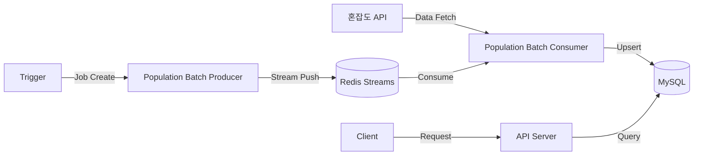

# Waggle Waggle (와글와글) Backend

서울시 주요 핫플레이스의 **실시간 인구 혼잡도, 교통 상황, 사고 정보**를 수집하고 제공하는 서비스의 백엔드 시스템입니다.  
NestJS 기반의 **Monorepo**로 구성되어 있으며, 주기적인 데이터 수집을 위해 **Redis Streams**를 활용한 이벤트 기반 아키텍처를 채택했습니다.

## System Architecture (전체 구조)

데이터의 **수집(Batch)**과 **서빙(API)** 책임을 분리하여 안정적인 서비스를 제공합니다.



## Workspace Structure (폴더 구조)

이 프로젝트는 `pnpm workspace`를 사용합니다.

| 분류     | 패키지명               | 경로                        | 설명                                     |
| -------- | ---------------------- | --------------------------- | ---------------------------------------- |
| Apps     | api                    | apps/api                    | 클라이언트 요청을 처리하는 REST API 서버 |
|          | place-population-batch | apps/place-population-batch | 인구 데이터 수집 Producer와 Consumer     |
| Packages | entity                 | packages/entity             | TypeORM Entity 및 Database 공통 모듈     |
|          | redis                  | packages/redis              | Redis 연결 및 설정 공통 모듈             |

## Tech Stack

- **Framework**: `NestJS` (`Node.js`)
- **Language**: `Typescript`
- **Database**: `MySQL(TypeORM)`, `Redis`
- **Event Driven Architecture**: `Redis Streams`, `Producer/Consumer`, `Cron`
- **Package Manager**: `pnpm`
- **Infra/Tools**: `Docker`, `PM2` (Optional)

## Getting Started

1. 의존성 설치

```bash
$ pnpm install
```

2. 환경 변수 설정 각 `apps/` 폴더 내의 `.env.example`을 참고하여 `.env` 파일을 생성합니다.
3. 서비스 실행

```bash
# API 서버 실행
$ pnpm --filter api start:dev

# Batch 실행
# Producer
pnpm --filter place-population-batch start:producer

# Consumer
pnpm --filter place-population-batch start:consumer
```
